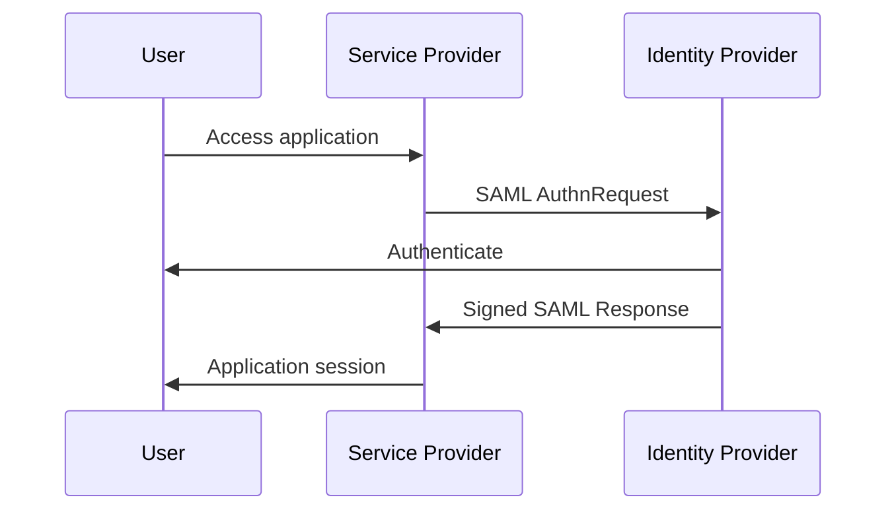

# Lab 08 - SSO, SAML 2.0, OAuth 2.0 and OIDC

## SAML
Roles: Identity Provider and Service Provider.

Troubleshooting:
- Entity ID mismatch
- bad ACS URL
- expired certificate
- NameID mismatch
- missing attributes
- clock skew

## OAuth 2.0
Understand client, resource owner, authorization server, resource server, access token and scopes.

## OIDC
OIDC adds identity on top of OAuth 2.0 using ID tokens and claims.

## Exercise
Create attribute mappings for email, employee ID, department and group claims.
