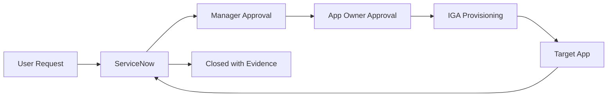

# Lab 09 - ServiceNow IAM Workflow

## Use Cases
Access requests, IAM incidents, changes, disconnected application fulfillment, certification remediation and termination validation.

## Example Flow

## Exercise
Use `data/servicenow_tickets.csv`.

Classify each item as request, incident, change or remediation, then determine priority, resolver group and required evidence.
