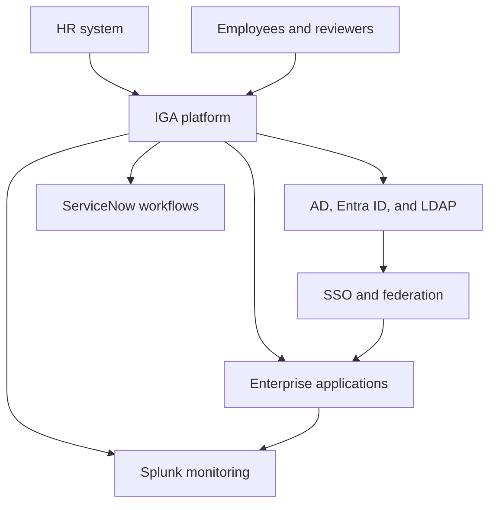

# IAM_Nikhi | Practical IAM & IGA Lab Portfolio

A growing portfolio of identity and access management (IAM) and identity governance and administration (IGA) exercises covering identity lifecycle, access governance, integrations, and troubleshooting.

**For recruiters:** Start with the [JML lab](https://github.com/IAM-Nikhi/iam-jml-practical-lab), [SailPoint operations lab](https://github.com/IAM-Nikhi/sailpoint-operations-lab), and [Saviynt onboarding lab](https://github.com/IAM-Nikhi/saviynt-application-onboarding-lab). These contain scenario documentation and sample CSV files. The [Active Directory lab](https://github.com/IAM-Nikhi/active-directory-ldap-lab) contains two PowerShell scripts.

All organizations, identities, applications, tickets, events, and data in this portfolio are fictional or sanitized.

## Status Guide

Statuses reflect the files available at the linked destination, reviewed on October 10, 2026.

- **Starter:** Initial documentation, sample data, or example scripts are available. A completed implementation and validated results are not yet documented.
- **In progress:** Reserved for labs with a partial implementation and documented execution or results beyond starter material. No lab is assigned this status in the current review.
- **Planned:** No lab content is published at the destination, or the topic remains on the portfolio roadmap.

## Lab Directory

The original lab numbers are retained for easy reference. Labs 02–12 link directly to their standalone repositories; Lab 01 is documented in this portfolio.

| Lab | Project | Focus and available content | Status |
|---|---|---|---|
| 01 | [Enterprise IAM architecture](01-ENTERPRISE-IAM-ARCHITECTURE/README.md) | Fictional enterprise scenario, system-of-record matrix, and architecture discussion exercise. See the [learning roadmap](00-ROADMAP/README.md). | **Starter** |
| 02 | [Joiner-Mover-Leaver](https://github.com/IAM-Nikhi/iam-jml-practical-lab) | HR-driven onboarding, role changes, and termination. JML walkthrough plus mover and leaver CSVs; joiner and expected-state files are not yet in this repository. | **Starter** |
| 03 | [SailPoint operations](https://github.com/IAM-Nikhi/sailpoint-operations-lab) | Provisioning, stale certification access, and mover troubleshooting scenarios; identity snapshot CSV and root-cause analysis exercise. | **Starter** |
| 04 | [RSA IGL governance](https://github.com/IAM-Nikhi/rsa-igl-governance-lab) | Access-review and remediation exercise covering terminated identities, orphan accounts, and privileged access. README only; the referenced review-population CSV is not yet included. | **Starter** |
| 05 | [Saviynt application onboarding](https://github.com/IAM-Nikhi/saviynt-application-onboarding-lab) | VendorPay onboarding scenario with entitlement approvals, segregation-of-duties rules, design tasks, and an application configuration CSV. | **Starter** |
| 06 | [Active Directory + LDAP](https://github.com/IAM-Nikhi/active-directory-ldap-lab) | PowerShell examples to export stale AD users and list privileged group members. No lab README or LDAP exercise is published yet. | **Starter** |
| 07 | [Microsoft Entra ID governance](https://github.com/IAM-Nikhi/entra-id-governance-lab) | README exercises for groups, role assignments, guest access, Conditional Access, and privileged access reviews; includes a policy-design example. | **Starter** |
| 08 | [SSO and federation](https://github.com/IAM-Nikhi/sso-federation-lab) | README covering SAML, OAuth 2.0, and OpenID Connect concepts, claims mapping, and SSO troubleshooting. | **Starter** |
| 09 | [ServiceNow IAM workflows](https://github.com/IAM-Nikhi/servicenow-iam-workflow-lab) | README with an access-request approval flow and ticket-classification exercise covering requests, incidents, changes, and remediation. | **Starter** |
| 10 | [Splunk IAM monitoring](https://github.com/IAM-Nikhi/splunk-iam-monitoring-lab) | Monitoring scenarios and two example SPL queries in the README. Event data and execution results are not yet included. | **Starter** |
| 11 | [SQL, CSV, and REST API integration](https://github.com/IAM-Nikhi/iam-sql-api-integration-lab) | README outlining identity/account joins, orphan-account detection, API request modeling, and CSV correlation; implementation files are not yet included. | **Starter** |
| 12 | [Reconciliation and orphan accounts](https://github.com/IAM-Nikhi/iam-reconciliation-lab) | Planned identity-to-account reconciliation and orphan-account analysis. Repository exists and is currently empty. | **Planned** |

Some original lab folders in this portfolio contain additional starter files. The statuses and availability notes above describe the linked destinations; standalone repositories do not yet contain every file from those folders.

## Additional Planned Labs

These retain their original portfolio numbers. No corresponding lab folders or standalone repository links are published in this directory yet.

| Lab | Topic | Planned scope | Status |
|---|---|---|---|
| 13 | RBAC, SoD, and access certification | Role design, conflicting access, reviewer decisions, and remediation tracking. | **Planned** |
| 14 | SOX, ISO 27001, and NIST control mapping | Map identity controls to evidence and review activities. | **Planned** |
| 15 | Privileged access governance | Privileged entitlement ownership, approvals, periodic reviews, and exceptions. | **Planned** |
| 16 | IAM incident troubleshooting | Investigate identity, connector, provisioning, and access failures. | **Planned** |
| 17 | IAM KPI and governance reporting | Track provisioning performance, review progress, and remediation aging. | **Planned** |
| 18 | Interview-ready case studies | Document business problems, identity risks, actions, evidence, and results. | **Planned** |

## Enterprise Reference Architecture

This conceptual architecture provides context for the exercises. It does not represent a deployed environment.

## Portfolio Coverage

Current starter material introduces JML, SailPoint, RSA IGL, Saviynt, Active Directory, Microsoft Entra ID, SSO/federation, ServiceNow workflows, Splunk monitoring, and SQL/API/CSV integration concepts. The directory distinguishes documentation and examples from planned implementation work.

Broader governance topics, including RBAC, SoD, access certification, privileged access, and SOX/ISO 27001/NIST control mapping, are part of the [learning roadmap](00-ROADMAP/README.md). Completed exercises, execution evidence, and case-study outcomes will be added as the labs develop.
