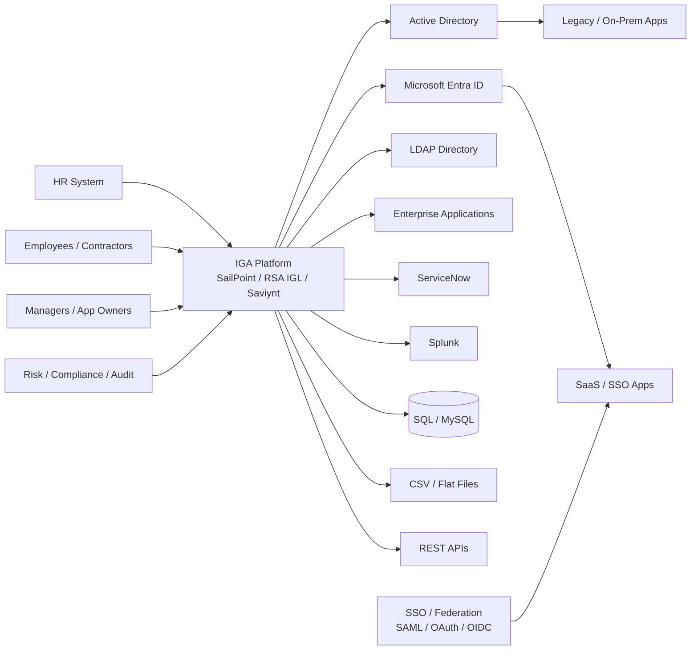

# IAM_Nikhi | Practical IAM & IGA Lab Portfolio

A hands-on IAM / IGA portfolio designed to demonstrate practical identity operations, governance, integrations, troubleshooting, and compliance concepts across:

- SailPoint
- RSA Identity Governance & Lifecycle (RSA IGL)
- Saviynt
- Active Directory
- Microsoft Entra ID / Azure AD
- LDAP
- SAML 2.0
- OAuth 2.0
- OpenID Connect
- ServiceNow
- Splunk
- SQL / MySQL
- REST APIs
- CSV / flat-file integrations
- SOX ITGC
- ISO 27001
- NIST
- Least Privilege
- RBAC
- SoD
- Access Certification
- Privileged Access Governance

All organizations, identities, applications, tickets, events, and data in this portfolio are fictional or sanitized.

## Portfolio Structure

| Lab | Focus |
|---|---|
| 01 | Enterprise IAM architecture and roadmap |
| 02 | Joiner-Mover-Leaver practical lab |
| 03 | SailPoint operations lab |
| 04 | RSA IGL governance lab |
| 05 | Saviynt application onboarding lab |
| 06 | Active Directory + LDAP lab |
| 07 | Microsoft Entra ID governance lab |
| 08 | SSO, SAML, OAuth, OIDC lab |
| 09 | ServiceNow IAM workflow lab |
| 10 | Splunk IAM monitoring lab |
| 11 | SQL, CSV, API integration lab |
| 12 | Reconciliation and orphan-account lab |
| 13 | RBAC, SoD, access certification lab |
| 14 | SOX, ISO 27001, NIST control mapping lab |
| 15 | Privileged access governance lab |
| 16 | IAM incident troubleshooting lab |
| 17 | IAM KPI and governance reporting lab |
| 18 | Interview-ready case studies |

## Recruiter View

This repository is designed to answer a practical question:

> "Can this candidate explain how enterprise identity actually works from HR onboarding through provisioning, governance, access reviews, troubleshooting, compliance, and termination?"

The labs intentionally include:
- architecture diagrams,
- step-by-step exercises,
- sample source files,
- SQL queries,
- PowerShell,
- API payloads,
- access-review datasets,
- incident tickets,
- control evidence,
- troubleshooting checklists,
- expected results.

## Enterprise Reference Architecture

## Skills Demonstrated

`IAM` `IGA` `SailPoint` `RSA IGL` `Saviynt` `Active Directory` `Microsoft Entra ID` `LDAP` `SAML` `OAuth2` `OIDC` `ServiceNow` `Splunk` `SQL` `REST API` `CSV` `JML` `RBAC` `SoD` `Access Certification` `SOX ITGC` `ISO 27001` `NIST` `PAM` `Least Privilege`
